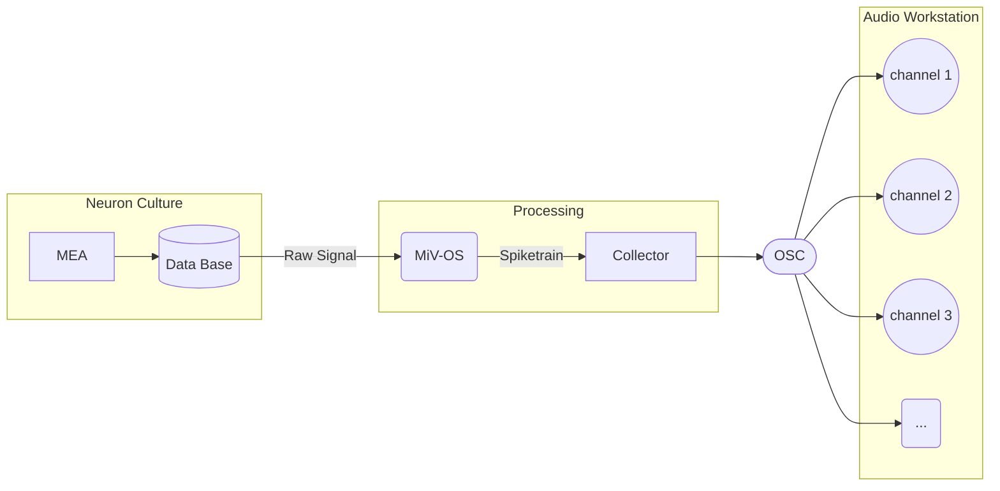

# Listening To Spike

Experimental scripts to generate sound signal based on in-vitro neural spike signal. The module use OSC (open-sound control) protocol to connect to audio workstation.



## Installation

> At this moment, we only support `Mac-OS` for single-file installation. For other OSs, user can install the package and dependencies using `poetry`.

The installation package (`.dmz` file) can be found [here](https://github.com/skim0119/listening-to-spike/releases).

## How to Use

1. Select spike-recording to load. (This process can take some time, depending on the size of the signal)
2. Configure IP and port number for OSC protocol.
3. Click play (_stop button is not functioning at this point_)

## Debugging

### OSC Server

To launch test osc-server, use CLI tool:

```sh
-> % osc-listener --help
Usage: osc-listener [OPTIONS]

Options:
    --ip TEXT       The ip to listen
    --port INTEGER  The port to listen
    --help          Show this message and exit.
```
